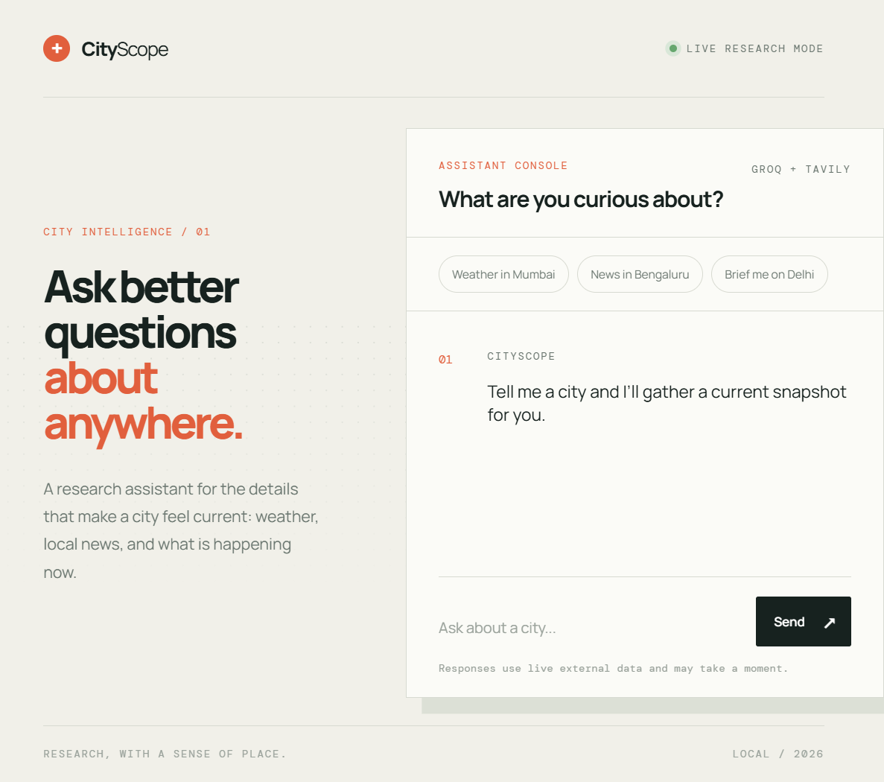

# CityScope



CityScope is a live city research assistant that brings weather, local news, and quick city briefs into one focused interface. Ask a natural-language question about a place and the assistant uses an LLM with live external tools to gather a useful, current answer.

## The problem it solves

City research is usually fragmented across search results, weather apps, news sites, and scattered tabs. That makes a simple question such as "What is happening in Bengaluru today?" slower to answer and harder to summarize.

CityScope provides one conversational starting point. It interprets the question, calls the relevant research tools, and returns the result in a readable response instead of making the user collect and compare information manually.

## What it can do

- Get current weather for a city using OpenWeather.
- Find recent local news using Tavily search.
- Combine multiple sources when a question needs a broader city brief.
- Understand natural-language requests instead of requiring fixed commands.
- Show live research progress in a responsive browser interface.
- Run locally or deploy as a standard Flask application.

## How it works

```text
Browser UI
		|
		v
Flask /api/chat endpoint
		|
		v
LangChain city agent
		|--------------------|
		v                    v
OpenWeather          Tavily Search
		\____________________/
						 |
						 v
			 Groq response
```

The frontend is served by Flask. Requests are sent to `/api/chat`, which invokes the reusable `run_city_agent()` function in `City_Research_agent.py`. The agent decides whether to use weather, news, or both tools before returning the final response.

## Tech stack

- Python and Flask
- LangChain agent orchestration
- Groq for the language model
- Tavily for current news research
- OpenWeather for live weather data
- Vanilla HTML, CSS, and JavaScript frontend

## Run locally

1. Create a virtual environment and install dependencies:

	 ```powershell
	 .\.venv\Scripts\python.exe -m pip install -r requirements.txt
	 ```

2. Create `.env` from `.env.example` and add your API keys:

	 ```powershell
	 Copy-Item .env.example .env
	 ```

3. Start the application:

	 ```powershell
	 .\.venv\Scripts\python.exe app.py
	 ```

4. Open [http://127.0.0.1:5000](http://127.0.0.1:5000).

## Deploy on Render

Create a new Web Service from this GitHub repository with:

```text
Build command: pip install -r requirements.txt
Start command: gunicorn app:app
```

Add these environment variables in Render:

```text
GROQ_API_KEY
TAVILY_API_KEY
OPENWEATHER_API_KEY
```

Do not upload `.env` or place API keys in source code. Rotate any key that has been exposed publicly before deploying.

## Project structure

```text
app.py                    Flask server and JSON API
City_Research_agent.py    LangChain agent and research tools
templates/index.html      Application shell
static/styles.css         Visual design and responsive layout
static/app.js             Chat interactions and API calls
docs/cityscope-preview.png README preview image
.env.example              Required environment variable names
requirements.txt          Python dependencies
```

## API

`POST /api/chat`

Request:

```json
{
	"message": "What is the current weather in Mumbai?"
}
```

Response:

```json
{
	"response": "..."
}
```